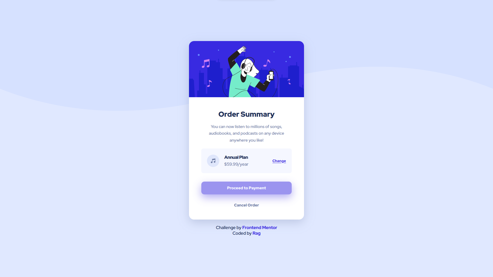

# Frontend Mentor - Order summary card solution

This is a solution to the [Order summary card challenge on Frontend Mentor](https://www.frontendmentor.io/challenges/order-summary-component-QlPmajDUj). Frontend Mentor challenges help you improve your coding skills by building realistic projects. 

## Table of contents

- [Overview](#overview)
  - [The challenge](#the-challenge)
  - [Screenshots](#screenshots)
  - [Links](#links)
- [My process](#my-process)
  - [Built with](#built-with)
- [Author](#author)
- [Acknowledgments](#acknowledgments)

## Overview

### The challenge

Users should be able to:

- See hover states for interactive elements

### Screenshots

- Desktop Site:

- Mobile Site:

- Active, Focus & Hover States:

### Links

- [Solution](https://github.com/ragonscreen/frontend-mentor-order-summary-component)
- [Live Site](https://ragonscreen.github.io/frontend-mentor-order-summary-component/)

## My process

### Built with

- Semantic HTML5 markup
- CSS custom properties
- Flexbox
- CSS Grid
- Mobile-first workflow

## Author

- Frontend Mentor - [@ragonscreen](https://www.frontendmentor.io/profile/ragonscreen)

## Acknowledgments

- As always, I would like to thank [Kevin Powell](https://www.youtube.com/@KevinPowell) for introducing me to Frontend Mentor and his other awesome CSS guides.
